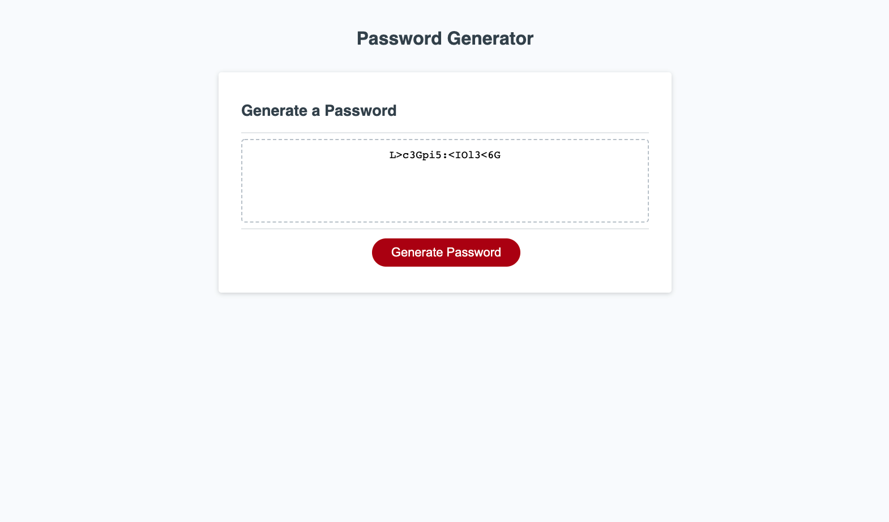

# Jacob Canepa's Password Generator 

## Description
This application allows users to generate secure and truely random passwords tailored to their preferences.

## Table of Contents
-[Usage](#usage)
-[Questions](#questions)

## Usage
Click "Generate Password" in order to trigger the series of prompts. Once all prompts are answerd a random password will generate onto the user's screen.

Deployed Link: https://jacobmcanepa.github.io/password-generator/

## Questions
Github: https://github.com/jacobmcanepa

Email: jacobmcanepa@gmail.com
